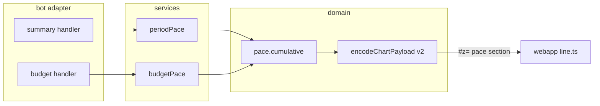

# 0042: Spending pace in the chart, and a burn-down chart for the budget

> **Status:** done (2026-10-07): built as planned, one minor and one nit fixed at close, one nit open, Phase 3 live check owed, v0.32.0
> **Created:** 2026-10-07
> **Depends on:** [Plan 0041](0041-chart-capacity-and-period-comparison.md) (payload v2 and its sections), merged on `main` first
> **Related ADRs:** [ADR-0045](../../adrs/0045-chart-payload-v2-deflated-sections.md) (payload v2: deflated sections),
> [ADR-0017](../../adrs/0017-budgets-payday-periods-cumulative-allowance.md) (payday periods, cumulative allowance),
> [ADR-0023](../../adrs/0023-budgets-count-converted-spending.md) (budget conversion)

## TL;DR

The `/week` and `/month` chart gets a pace section: a line of cumulative spending by day for the
shown period, drawn over the same line for the previous period. Next to it is a caption for each:
how much had been spent by today, and how much by the same day last period. The `/budget` screen
gets its own «📈 Диаграмма»: the budget period's cumulative spend by day against the limit's
allowance line, with today's leftover stated in words, as the budget screen states it. The first
thing the user sees: `/month`, «📈 Диаграмма», and under the donut, «К 15 октября: 45 230.00 RSD»
on a rising line, with September's line lighter behind it.

## Context & problem

"Am I spending faster than last month?" is the question a pie can't answer. The text screens can't
either: they show totals, not the path to them. The budget screen states today's leftover
allowance (ADR-0017) as one number. The shape of the period, a burst early and then flat, gets
lost.

The data needed is daily sums of converted spending. Expenses already carry `occurred_on` in the
ledger's timezone, and both the summary and the budget convert each expense at its day's rate and
round before summing (ADR-0022, ADR-0023). The daily sums therefore add up exactly to the totals
the screens show.

## Decision

- **A new `pace` section in the v2 payload.** It carries the period length in days, the
  cumulative minor units per elapsed day for the current series, optionally the full previous
  series, an optional limit, and bot-formatted captions.
- **Pure cumulative sums.** A new `src/domain/pace.ts` builds the series from
  `(occurredOn, convertedMinor)` pairs and a period start. Two services feed it the same converted
  expenses their screens count: `src/services/periodPace.ts` for `/week` and `/month`, and a
  `budgetPace` in `src/services/budget.ts` for `/budget`.
- **The allowance line is geometry.** The page draws it from (0, 0) to (days, limit). Every number
  the user reads is a bot caption that matches the budget screen's text, including today's
  leftover, so the user never has to judge the gap between the lines by eye.
- **Each caption is keyed to its line.** A caption carries a swatch in its line's colour, the way
  a legend row does.
- **The y-axis fits every line.** Its top is the largest of the last current point, the last
  previous point and the limit, so an overspent period stays inside the chart.
- **Days align by position.** Day *d* of this period is drawn against day *d* of the previous one.
  A shorter previous period simply ends early.

We rejected drawing the budget's limit on the `/month` pace line. A budget runs over payday periods
(ADR-0017) that start on any day, so it rarely lines up with a calendar month, and a limit drawn
over the wrong range misleads. The budget gets its own chart on its own screen instead.

## Architecture diagram



## Implementation phases

### Phase 1: Walking skeleton: the pace line on the `/month` chart
- **Owner skill:** dev
- **What:**
  - `src/domain/pace.ts` exports `cumulativeByDay(items, from, days, through)`.
  - `src/services/periodPace.ts` reads the shown period and the one before it, converted into the
    ledger's currency the way `ledgerPeriodSummary` converts them.
  - `messages.chartPace` formats the two captions. The current period's series runs through today,
    or the whole period once it's past. The copy:
    - a running period: «К 15 октября: 45 230.00 RSD» and «К 15 сентября: 38 100.00 RSD»
    - a past period, after «За» in the form `periodAfterZa` gives: «За август 2026: …» and
      «За июль 2026: …»; for weeks «За неделю 21–27 сентября: …»
  - The page gets `webapp/src/line.ts`, which draws the `pace` section. The previous series is a
    muted line and the current one an accent line. Each caption sits above the chart as text,
    after a swatch in its line's colour.
  - The y-axis top is the largest of the two series' last points (and the limit, Phase 2).
  - The encoder's shedding order (Plan 0041) gains two steps after the change labels: first the
    pace section's previous series, then the pace section.
- **Files touched:** `src/domain/pace.ts`, `src/domain/pace.test.ts`, `src/domain/chartPayload.ts`,
  `src/domain/chartPayload.test.ts`, `src/services/periodPace.ts`,
  `src/services/periodPace.test.ts`, `src/bot/messages.ts`, `src/bot/handlers/summary.ts`,
  `src/bot/bot.test.ts`, `webapp/src/payload.ts`, `webapp/src/payload.test.ts`,
  `webapp/src/line.ts`, `webapp/src/main.ts`, `README.md` (Mini App: charts).
- **Done when:**
  - `cumulativeByDay` with items on day 1 (1000), day 1 (500) and day 3 (2000), for a 5-day period
    through day 4, returns `[1500, 1500, 3500, 3500]`: four points with no gap for day 2. An item
    after `through` is not counted.
  - Take a month ledger in Europe/Belgrade opened on 2026-10-15. The pace section has `days` 31,
    15 current points (Oct 1–15) and 30 previous points (all of September).
  - An expense with `occurred_on` 2026-10-01, recorded at 2026-09-30T22:30Z (00:30 in Belgrade),
    counts in October's day 1 and not in September.
  - When no expense in the period is dated after today, the current series' last point equals the
    pie section's `totalMinor`. The previous series' last point equals the previous trend bar's
    `totalMinor`. A test with a converted EUR expense asserts both, so per-expense rounding agrees
    across the screens.
  - The previous caption names the cumulative at day min(15, 30) = 15 of September.
  - For a past period (paged to August 2026 on 2026-10-15), the current series has all 31 points.
  - A `/week` chart has `days` 7.
  - The page draws two `polyline`s: the previous one muted and the current one in the accent
    colour. Both captions arrive only as `textContent`, each after a swatch whose `fill` is its
    polyline's `stroke`. A v2 payload without a `pace` section draws as in Plan 0041.
  - With a previous series ending at 90000 and a current one at 45000, every point of both
    polylines lies inside the viewBox, and the previous line's last point touches its top.
  - A past August chart's captions are «За август 2026: …» and «За июль 2026: …».

### Phase 2: The budget burn-down chart
- **Owner skill:** dev
- **What:**
  - In a private chat with `WEBAPP_URL` set, the `/budget` screen gets a «📈 Диаграмма» `web_app`
    button, but only when the budget has a limit and the ledger isn't locked. It is the first
    keyboard row, above the settings buttons, since it is the screen's one read action.
  - Its payload's title is «Бюджет: 25 сен – 24 окт», and it holds one `pace` section.
    The current series is the cumulative spend by day in the budget's currency, counted the way
    `budgetStatus` counts it: the scope's categories only, each foreign expense converted at its
    day's rate. It runs through today. The section has a `limit` with its caption, and no previous
    series.
  - The section's captions, in order, each after its line's swatch:
    - «Потрачено к 7 октября: 13 500.00 RSD», for the current series
    - today's leftover, with `todayLeft`'s wording from the budget screen: «Осталось на сегодня:
      …» or «Сегодня перерасход …», for the allowance line
    - «Лимит: 30 000.00 RSD»
  - The page draws the allowance line from (0, 0) to (days, limit) as a dashed line
    (`stroke-dasharray`) in the hint colour. The y-axis top is the larger of the limit and the
    series' last point.
- **Files touched:** `src/services/budget.ts`, `src/services/budget.test.ts`,
  `src/bot/handlers/budget.ts`, `src/bot/messages.ts`, `src/bot/bot.test.ts`,
  `webapp/src/line.ts`, `webapp/src/payload.ts`, `webapp/src/payload.test.ts`.
- **Done when:**
  - Take a budget with limit 3000000 (30 000.00 RSD) and start day 25, viewed on 2026-10-07. The
    period runs 2026-09-25 to 2026-10-24, so `days` is 30 (6 days in September plus 24 in
    October), and the current series has 13 points.
  - The series' last point equals the spend through today that `budgetStatus` counts, which is
    `allowanceThrough(3000000, 30, 13)` (= 1300000) minus `todayLeftMinor`. The test asserts it
    against `budgetStatus` on the same data.
  - With scope `optional`, an expense in an essential category is not in the series, as it isn't
    in `budgetStatus`.
  - The limit caption equals the budget screen's limit amount, formatted by the same `messages`
    helper. The leftover caption equals the screen's `todayLeft` line for the same status, in
    both its forms: a positive leftover and an overspend.
  - The title is «Бюджет: 25 сен – 24 окт».
  - With spend through today at 3500000 against a limit of 3000000, the series' last point lies
    inside the viewBox at its top, and the allowance line ends below it.
  - The chart button is the screen's first keyboard row.
  - With no limit (caps only), in a group chat, without `WEBAPP_URL`, or with a locked sealed
    ledger, there is no button. The screen is then byte-identical to today's.

### Phase 3: Live check
- **Owner skill:** human
- **Blocks merge:** no
- **What:** After the merge and the Pages run, open a real `/month` chart mid-month and the
  `/budget` chart on a phone.
- **Done when:**
  - The `/month` pace caption matches the text screen's total (when nothing is future-dated).
  - The budget chart's line ends at the screen's spend, and the allowance line reaches the limit
    on the period's last day.

## Data shapes

```ts
// illustrative: a v2 section (ADR-0045)
interface PaceSection {
  k: 'pace';
  days: number; // the period's length
  current: number[]; // cumulative minor units, one per elapsed day, day 1 first
  previous?: number[]; // the previous period, all its days
  limit?: [limitMinor: number, label: string]; // the budget chart only: «Лимит: …»
  captions: [current: string, second?: string]; // formatted by messages; `second` is the previous
  // series' caption, or on the budget chart today's leftover in the screen's `todayLeft` wording
}
```

## Risks & open questions

- **Money.** The series are integer cumulative sums of per-expense converted amounts, each rounded
  once as ADR-0023 rounds them. The allowance line and point positions are floats used for
  geometry only. No number the page shows comes from them.
- **Time.** Days come from `occurred_on` and the periods from the ledger's effective timezone
  (ADR-0015). "Today" is `deps.now()` in that timezone, never the browser's clock.
- **Payload size.** Two 31-point series of up to 8 digits each come to about 500 bytes of JSON
  before compression. The pace section is shed before the trend, so a crowded month loses its
  pace line rather than its trend.
- **Future-dated expenses.** A period's total counts them and the pace line through today doesn't.
  The equality done-when is stated for a period without them, and the caption says «к 15
  октября», not «всего».

## What this plan does NOT do

- Per-category budget caps as lines on the burn-down.
- A pace line for tags or products (Plan 0044 covers their charts).
- Projecting the period's end ("at this rate, 52 000 by the 31st").
- Group budgets in a chart (`web_app` buttons work only in private chats).

## Implementation log

> Written by `dev`: one row per phase as its commit lands, then the close block. **The phases
> above are the contract. This section records what happened.** Observations, never conclusions:
> no pass list, no self-assessment. Deviations and unmet done-whens are **always** disclosed.
> Keep it shorter than `## Implementation phases`.

| phase | owner | state | commit |
|---|---|---|---|
| 1: Walking skeleton: the pace line on the `/month` chart | dev | done | 468f2e8 |
| 2: The budget burn-down chart | dev | done | 7279552 |
| 3: Live check | human | owed | |

### Notes

- Phase 1, outside `Files touched`: `webapp/src/pie.ts` gained the `pace` branch of the section
  loop (`drawState`), which calls `drawPace` from `webapp/src/line.ts`. `webapp/src/main.ts` is
  unchanged: the loop lives in `pie.ts`.
- Phase 1: `src/domain/chartPayload.ts` also gained `encodePacePayload(title, pace)` (one pace
  section, nothing shed) and the `limit` field of the bot's `PaceSection`, for Phase 2, whose
  `Files touched` doesn't list the file. The page validates `limit` from Phase 2.
- Phase 1: the pace captions carry no «≈» when the series holds converted spending; the pie's
  total and the trend bars do.
- Phase 1: the x-axis spans the longer of `days` and the previous series, so a previous period
  longer than the shown one (31 against 30 days) ends at the right edge.
- Phase 1: the first commit attempt failed in the pre-commit hook on a 5 s timeout in
  `src/services/recurring.test.ts` ("an edited occurrence still opens, sealed under its own id");
  the rerun passed unchanged.
- Phase 2, outside `Files touched`: `budgetView` takes `ctx` first, to read the chat type, so its
  callers `src/bot/flows.ts` (two calls) and `src/bot/handlers/settings.ts` (one) pass it. The
  button then shows on every render of the screen: `/budget`, a settings answer, scope, the hub.
- Phase 2: the limit caption and the screen's limit line share a new `limitAmount` helper in
  `messages.ts`; the screen's text is unchanged.
- Phase 2: the limit caption sits after the allowance line's swatch, as the leftover caption does.
- Phase 2: the group done-when is asserted on a bound group without a budget (`groupBudget`'s
  "not set" text); the group composer never builds the private screen.
- Followup noticed, not acted on: a pace caption over converted spending has no «≈», unlike the
  pie total and the trend bars.

### Close triggers

- Phases 1-2 (`dev`) are done in 468f2e8 and 7279552. Phase 3 (`human`, does not block merge)
  has not started.
- Gate on the tip (7279552): `pnpm typecheck` exit 0; `pnpm lint` exit 0; `pnpm test` exit 0,
  141 files and 1988 tests passed; `pnpm build` exit 0; `pnpm build:webapp` exit 0;
  `node scripts/check-doc-links.mjs` exit 0, 335 relative links resolve.
- `CHART_PAYLOAD_BUDGET` is still 2048 and `CHART_PAYLOAD_VERSION` 2. No migration, dependency
  or `webapp/index.html` change.
- New files: `src/domain/pace.ts`, `src/services/periodPace.ts` (+ tests), `webapp/src/line.ts`.
  New exports: `encodePacePayload`, `PaceSection` (bot and page), `budgetPace`. New bot messages:
  `chartPace`, `budgetChart`.

## Close review

Closed 2026-10-07 on round 1, with no fix round. Fixed at close: minor 1 (the README now names the
`/budget` chart) in b77ed4e, and nit 2 (the two comments re-wrapped) in 37b393a. Nit 1 (the group
done-when tested on a group without a budget) stays open. Phase 3 (`human`, live check) is owed.
The review, in full:

### Plan 0042 review, round 1 (tip 45bb35648e02556d835512bf498dc84a79ec2a0e)

**Verdict:** Clean. Both dev phases land as the plan states and every named done-when has an
assertion that defends it. No blockers and no majors. One minor: the README never mentions the new
`/budget` chart. Two nits.

#### Gate (run in this session, on the tip)

- `pnpm typecheck`: exit 0
- `pnpm lint`: exit 0
- `pnpm test`: exit 0, 141 files and 1988 tests passed
- `node scripts/check-doc-links.mjs`: exit 0, 335 relative links resolve
- `git status --short` after the runs: empty

#### Lens 1: alignment

- Phases 1 and 2 (`dev`) are 468f2e8 and 7279552. Phase 3 (`human`, `Blocks merge: no`) is owed.
  Each phase has exactly one in-vocabulary owner tag.
- Deviations from `Files touched` are disclosed in the log: `webapp/src/pie.ts` instead of
  `main.ts`, `encodePacePayload` in `chartPayload.ts`, and the `budgetView(ctx, …)` callers in
  `flows.ts` and `settings.ts`. Each one is needed for its phase.
- Done-whens, with the assertion read:
  - `cumulativeByDay` returns `[1500, 1500, 3500, 3500]` and leaves out the item after `through`:
    `src/domain/pace.test.ts:268`.
  - October in Belgrade has `days` 31, 15 and 30 points: `src/services/periodPace.test.ts:625`
    and `src/bot/bot.test.ts` ("runs October through the 15th…").
  - The 00:30-Belgrade expense lands on October day 1 and not in September: `periodPace.test.ts:639`,
    plus the bot test via `say` at 2026-09-30T22:30Z (`pace.current[0] === 45000`).
  - The last current point equals the pie `totalMinor`, and the last previous point equals the
    previous trend bar, with converted EUR: `periodPace.test.ts:648` asserts both against
    `ledgerPeriodSummary`/`periodTrend`. The bot test asserts both against the decoded payload
    (146874 and 39127, which are the correct 117.4993 roundings).
  - The previous caption is day min(15, 30) = 15: «К 15 сентября: 600.00 RSD» (S1 only) is
    asserted.
  - A past August has 31 points, and its captions are «За август 2026: …» / «За июль 2026: …»:
    asserted in both the service and the bot test. A past week reads «За неделю 21–27 сентября».
  - `/week` has `days` 7: `periodPace.test.ts:691` and the bot's `/week` payload test.
  - Two polylines are drawn, previous muted and current accent. The captions are `textContent`
    only and each swatch's `fill` equals its polyline's `stroke`. A payload with no pace section
    draws as before: `webapp/src/payload.test.ts` "the pace section".
  - 90000 against 45000: every point is inside 0..320 × 0..160, the previous line ends at y=0 and
    the current one at y=80.
  - Budget: `days` 30, 13 points. The last point equals `allowanceThrough(3000000, 30, 13) -
    todayLeftMinor` against `budgetStatus` on the same data, with converted EUR:
    `src/services/budget.test.ts:409`. Scope `optional` drops the essential category (`:436`).
  - The limit caption and the leftover caption match the screen's lines in both forms
    (overspend 500.00, leftover 3 000.00). The title is «Бюджет: 25 сен – 24 окт». The button is
    row 0 and the remaining rows equal the screen without a URL: `src/bot/bot.test.ts:2662`.
  - 3500000 over 3000000: the spend ends at [138.67, 0] and the allowance ends at [320, 22.86],
    below the top.
  - No button with caps only, with a locked sealed ledger, or without `WEBAPP_URL`, and the screen
    then equals the screen without a URL. A group gets no button (see the nit below).
- Shedding: the order is change labels, the previous series with its caption, the pace, then the
  trend bars, then the fold. That matches the plan, and `chartPayload.test.ts` pins every step.
- No ADR is reversed. ADR-0045's section list is extended the way the plan decided. The payload
  version and budget are unchanged.
- The log is shorter than the phases section and discloses the deviations.

#### Lens 2: layering

- grammY stays in `src/bot/`. `src/domain/pace.ts` imports only domain modules. The services do
  the SQL reads through `db/` repositories.
- All copy (`chartPace`, `budgetChart`, `limitAmount`) is in `messages.ts`, and the handlers only
  assemble it.

#### Lens 3: correctness

- Money: the series are integer `safeAdd` sums of amounts that are already rounded per expense.
  The floats in `webapp/src/line.ts` are geometry only, and the page shows no number it computed
  itself.
- Time: the days come from `occurred_on`, and "today" is `localDateOf(now, effectiveTimezone)` in
  `periodPace` and `budgetStatus`'s period in `budgetPace`. Neither takes a browser clock or a
  server-local date.
- The page validates `pace` strictly: whole `days > 0`, safe-integer series, a limit that is a
  positive safe integer plus a string, and 1 or 2 captions. The rejection tests cover each case.
- Idempotency and privacy: no writes are added. Only aggregates travel, and no logs are added.

#### Findings

##### blocker

None.

##### major

None.

##### minor

1. **The README never mentions the `/budget` chart.**
   - Where: `README.md:32` (the `/budget` command row) and `README.md:301` (Mini App: charts,
     which says only "`/week` and `/month` … end with «📈 Диаграмма»").
   - Why it matters: Phase 2 adds a button the user sees on the budget screen, with its own chart
     and its own conditions (a limit is required; private chat; not locked). The user-facing doc
     says the chart button belongs to `/week` and `/month` only. Phase 2's `Files touched` didn't
     list the README, so this is a docs-freshness gap rather than a skipped criterion.
   - Fix: in the `/budget` row, add one sentence: «📈 Диаграмма» (private chat, with `WEBAPP_URL`
     and a limit) opens the period's spend by day against the limit's dashed allowance line,
     captioned with the screen's spend-by-today, today's leftover and the limit. In Mini App:
     charts, change the opening sentence to name `/budget` as well, or add a bullet for the
     burn-down.

##### nit

1. **The group done-when is tested on a group without a budget.**
   - Where: `src/bot/bot.test.ts:2719`.
   - Why: the done-when reads "in a group chat … there is no button", and the natural setup for
     it has a limit. The test binds a group with no budget, so it asserts the "not set" text. The
     button is structurally impossible there anyway: `src/bot/group/summary.ts:50` replies
     `groupBudget` with no keyboard. So the gap is coverage only, and the log discloses it.
   - Fix (optional): set the group ledger's limit with `setBudgetLimit` before the group
     `/budget`.
2. **Two comments are wrapped badly.**
   - Where: `src/bot/handlers/summary.ts:64` breaks off at "Undefined outside a private chat",
     and `webapp/src/line.ts:22` runs past the 100-column comment width.
   - Fix: re-wrap both paragraphs.

#### Bookkeeping owed (for the close session)

- Plan 0042's `## Followups` is empty. Move into it the log's noted followup: pace captions over
  converted spending carry no «≈», unlike the pie total and the trend bars.
- Bump the version (minor, feature plan): `package.json`, `CHANGELOG.md`, and a
  `versionAnnouncements` entry in `src/bot/messages.ts` (ADR-0013) naming the pace line on
  `/week`/`/month` and the `/budget` chart.
- Phase 3 (`human`, does not block merge) stays owed: a live check of both charts on a phone
  after the Pages run.
- Standard close: flip the status, `git mv` to `docs/plans/done/`, repair links, run
  `node scripts/check-doc-links.mjs`, and refresh `docs/plans/README.md`.

## Followups

- A pace caption over converted spending carries no «≈», unlike the pie's total and the trend
  bars (noted in the implementation log, Phase 1).
- The group `/budget` done-when is asserted on a group without a budget (review nit 1); setting
  the group ledger's limit first would test the natural case.
